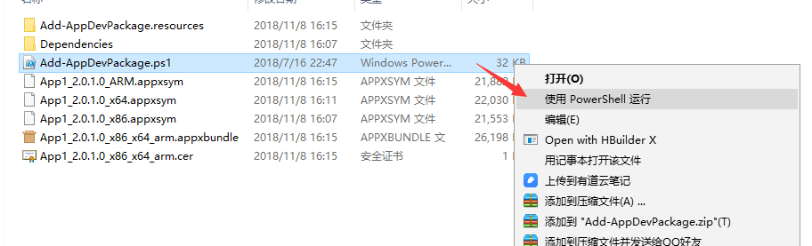
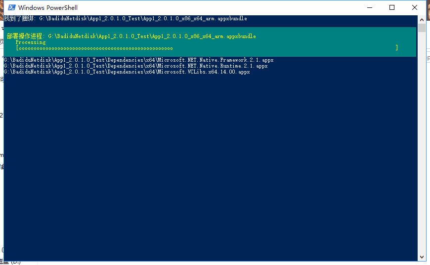
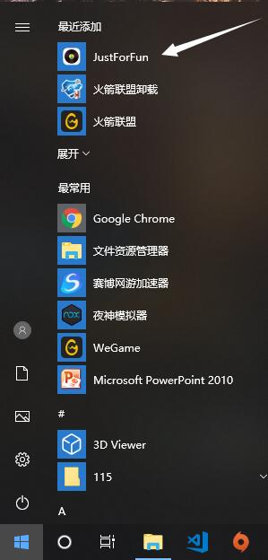
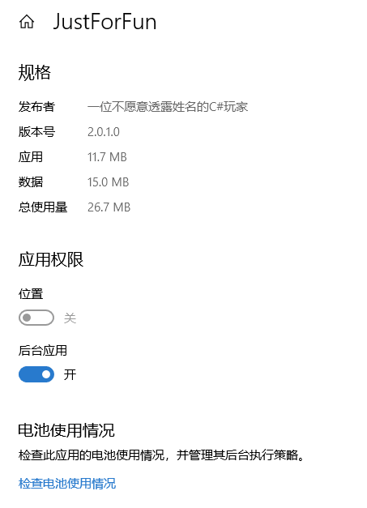
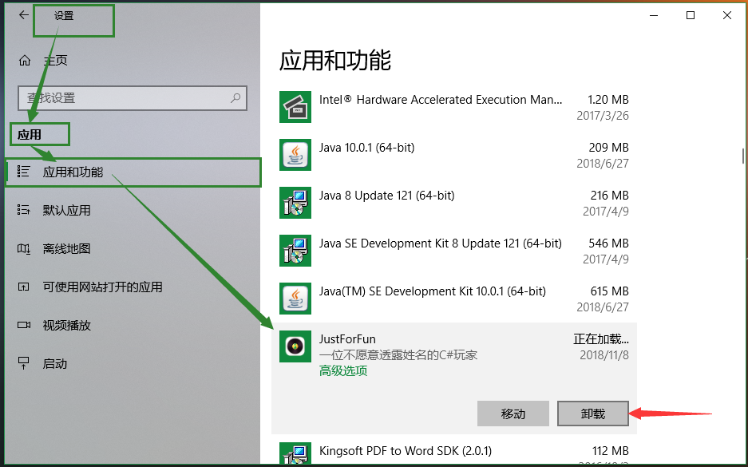

## 部署与安装

运行环境：**windows10**

运行环境：**windows10**

运行环境：**windows10**

**在决定是否要安装之前**

可以先在这里：https://github.com/jindada1/-UWP-Application 看看

里面有程序运行的截图，可以大概了解一下程序的样子

如果成功的吸引你，就可以👇

###正式安装部署

首先这个程序不大，应用大小只有11.7M，数据大小本人电脑上是15M，加起来不到30M

安装过程最多需要两步，

**1. 首先** 确保电脑开启开发者模式，因为是UWP应用程序，所以和一般的 exe 不太一样。

 

**2. 最后** 

下载并解压安装包

链接: https://pan.baidu.com/s/1sDQX5lIT1U-Hb2NNdiMjPw 

提取码: gb9i 

> 这个安装包有100来兆，远高于应用大小

解压好的安装包里面是这样的👇，如图所示右键选择在powershell打开

随后会询问你是否确认安装，输入 y 确认即可

然后就可以欣赏一下powershell的进度条

安装完成后就可以把一百多兆的安装包删了

### 运行 

安装完成后想要运行在左下角【开始】菜单里可以找到 JustForFun的磁贴

### 查看与卸载

卸载也很简单，打开【设置⚙】 →  选择 【应用】 → 点击【应用和功能】选项后，在右边就可以找到 JustForFun，你可以点击【高级选项】查看他的信息，也可以直接 **卸载** 

