### 操作系统
+ win 10

### 安装包zip链接
链接: https://pan.baidu.com/s/1sDQX5lIT1U-Hb2NNdiMjPw 
提取码: gb9i

### 安装方式
+ 设置里 开启开发者模式
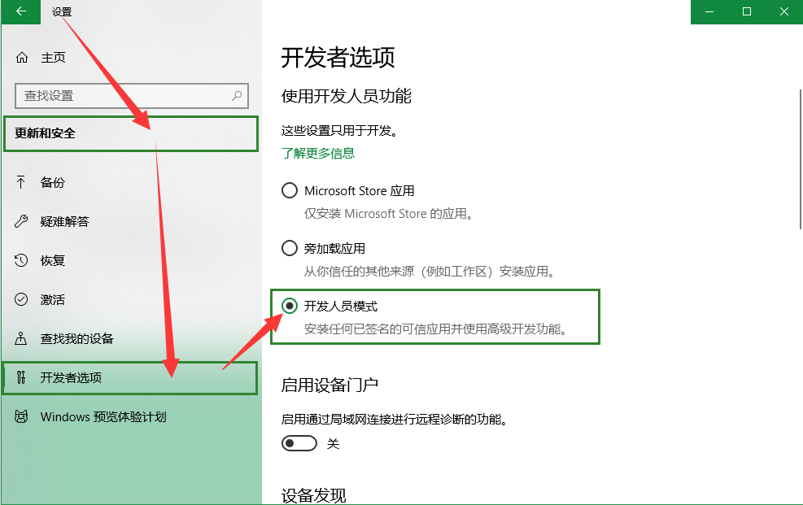

+ 打开下载的zip安装包，右键点击Add-AppDevPackage.ps1（带一点蓝色图标），选择在powershell中打开，然后在powershell里一路按 y 确定就好了

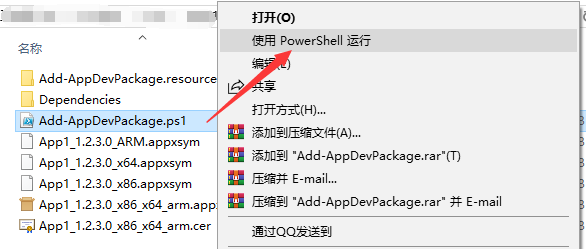

### 跑源码
+ 重新生成
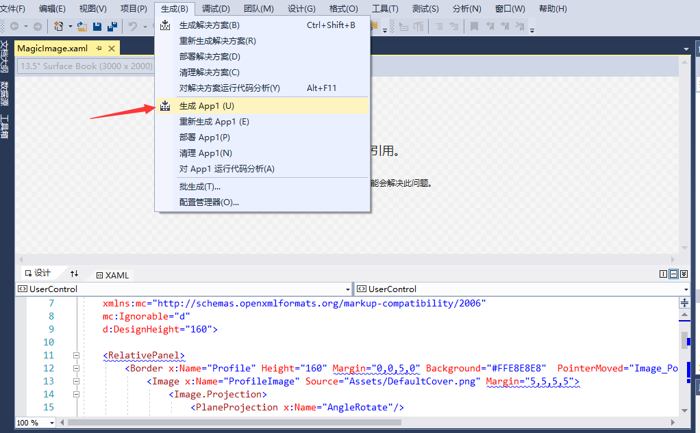

### 运行截图

**simple icon**

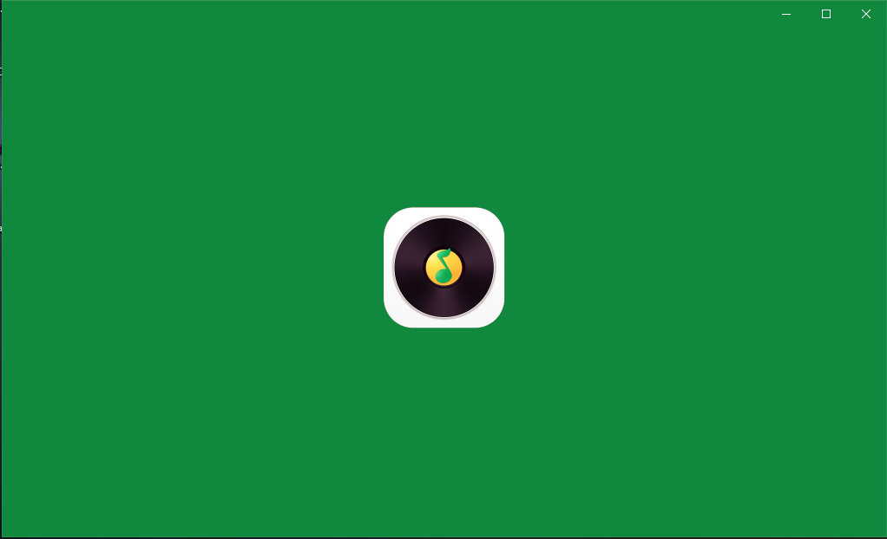

**首页——歌手排行**

**首页——单曲榜单 —内地巅峰榜**

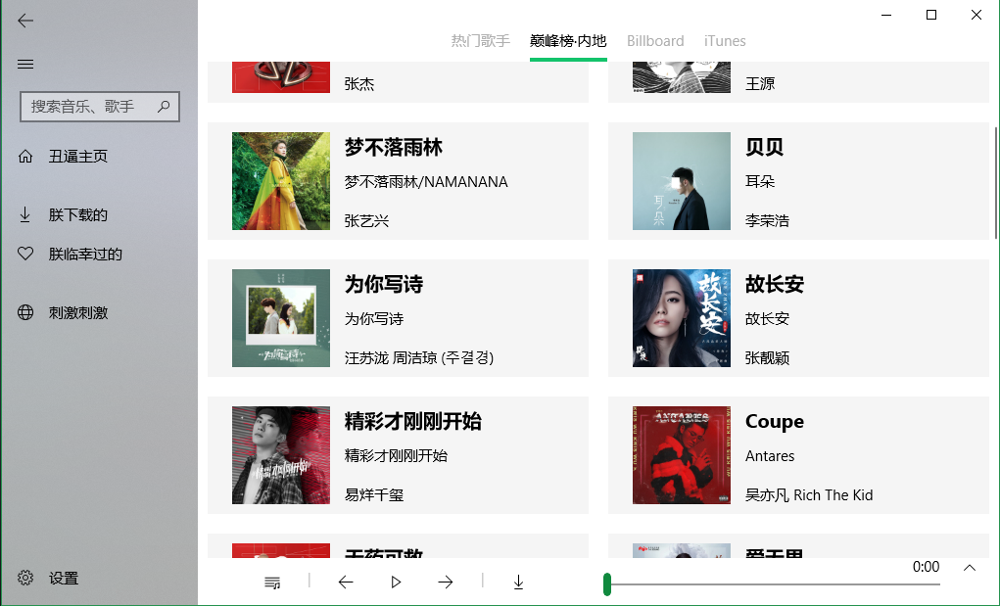

**选中播放一首：“为你写诗”**

**返回到歌手页面，点击进入周杰伦主场，播放“等你下课(with 杨瑞代)”，点开查看播放队列**

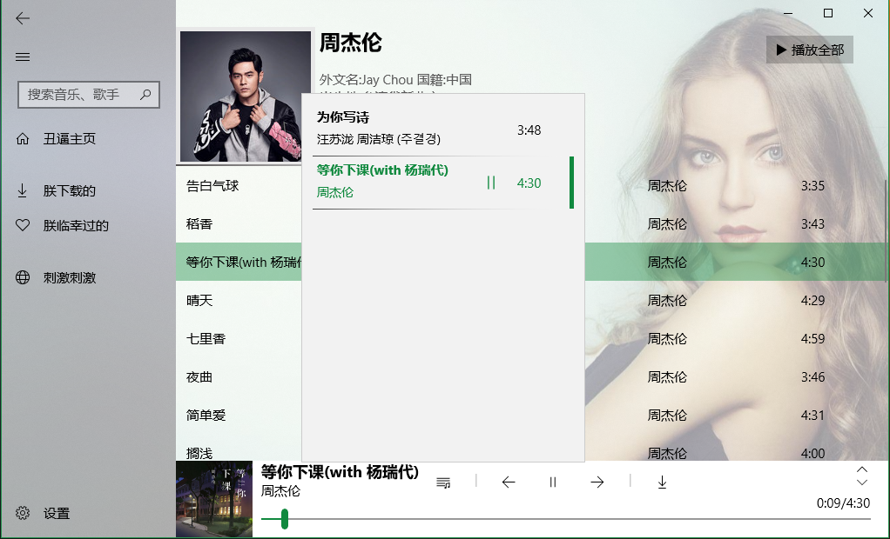

**展开播放区域**

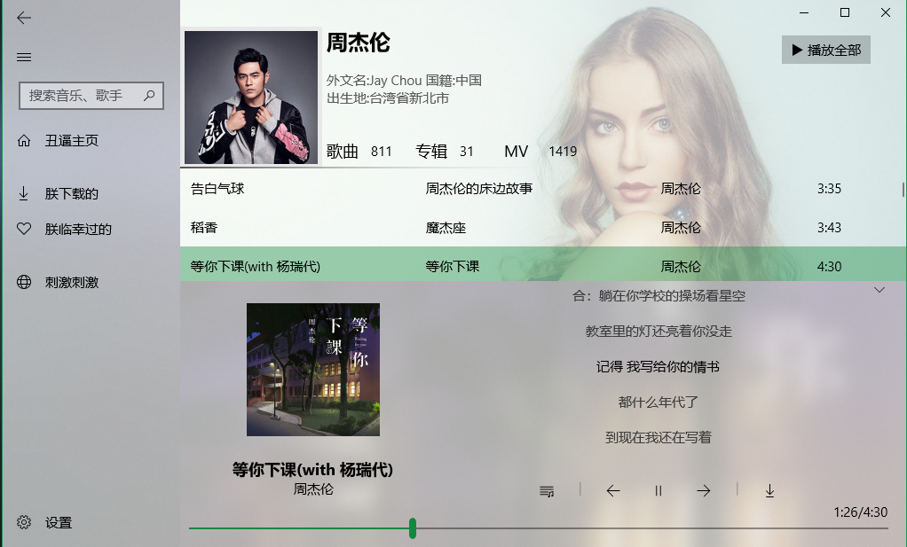

**将播放区域缩到最小，往下滚动歌单，歌手信息卡片自动隐藏**

**右击选中歌曲**

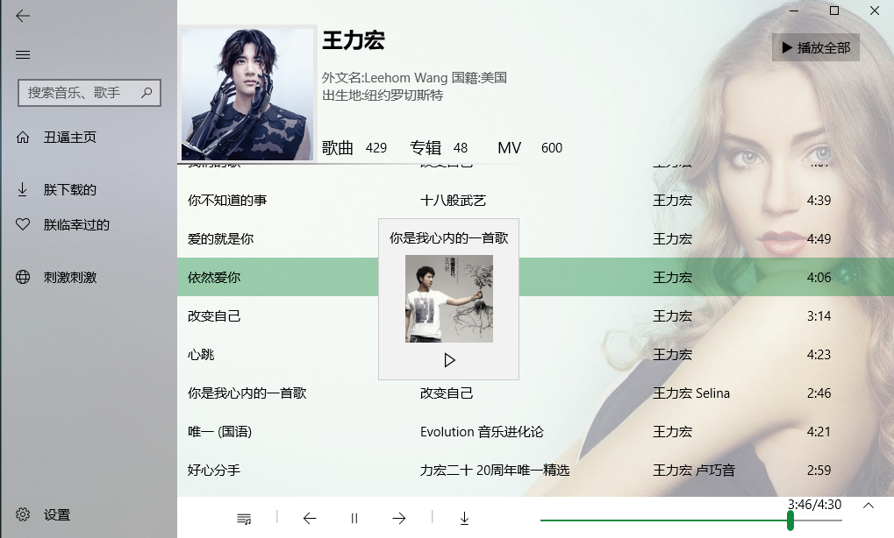

**点击播放全部，打开播放列表**

**搜索框输入Taylor，进入霉霉主场（全是付费），但畅听无阻，随意下载**

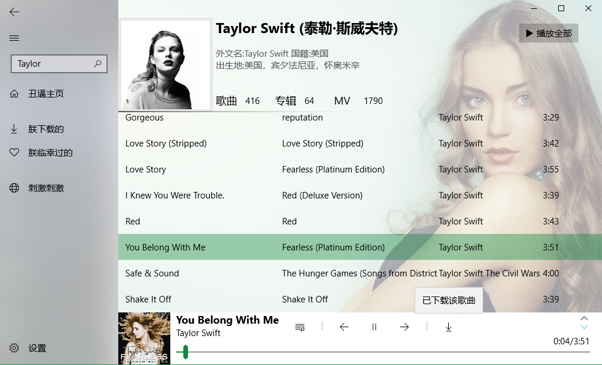

**2.0添加的短视频功能**
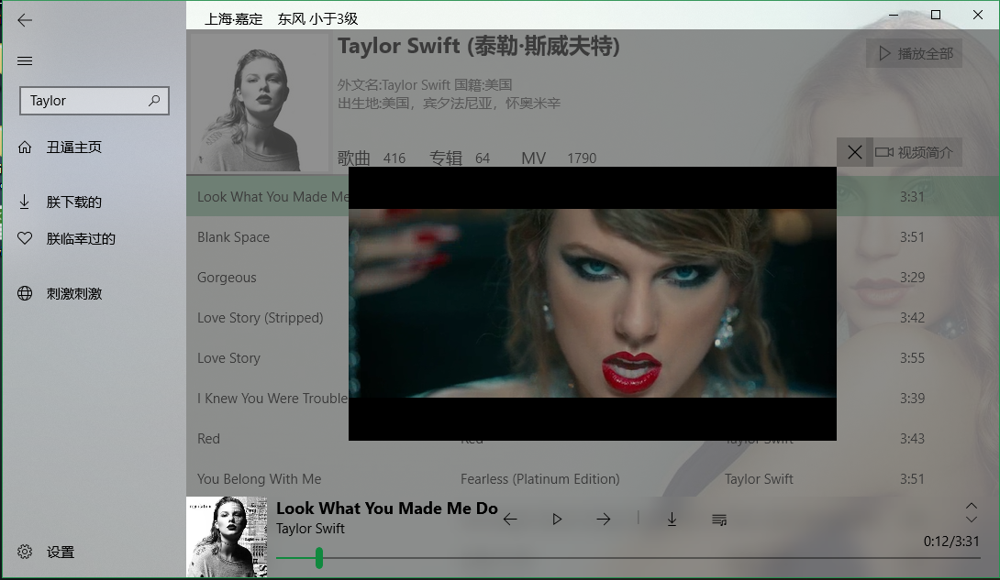

**下载的本地文件**

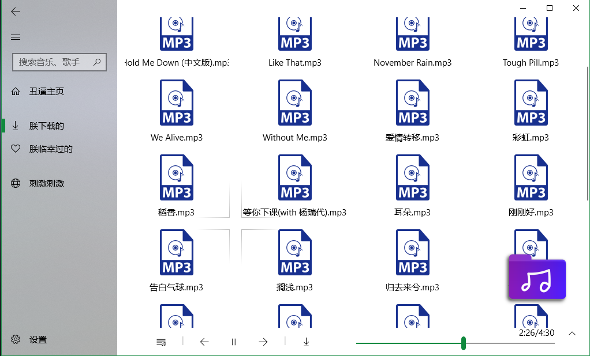

**点击右下方紫色的文件夹图标，跳转到文件资源管理器，发现下载的文件大概都在9M左右**

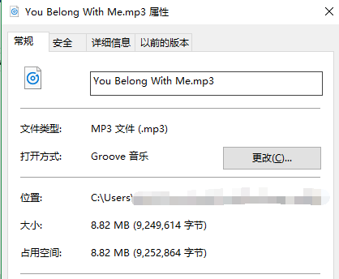

**我主动搜索过的，历史记录**

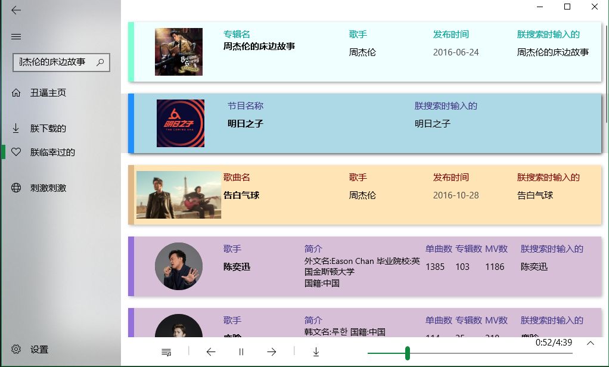
